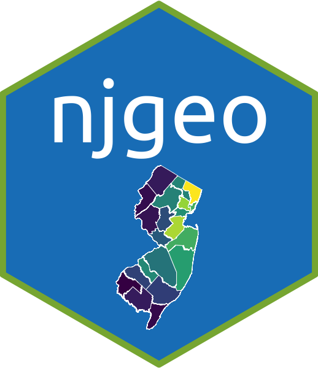

<!-- README.md is generated from README.Rmd. Please edit that file -->

```{r, include = FALSE}
knitr::opts_chunk$set(
  collapse = TRUE,
  comment = "#>",
  fig.path = "man/figures/README-",
  out.width = "100%"
)
library(njgeo)
```

# njgeo <a href='https://gavinrozzi.github.io/njgeo/'></a>

<!-- badges: start -->
[](https://github.com/gavinrozzi/njgeo/actions/workflows/R-CMD-check.yaml)
<!-- badges: end -->

Tools for geocoding addresses using the State of New Jersey's official geocoding service & accessing spatial data.

## Installation

You can install the development version of njgeo from [GitHub](https://github.com/) with:

``` r
# install.packages("devtools")
devtools::install_github("gavinrozzi/njgeo")
```

## Usage

### Geocoding

This package supports freely geocoding addresses in New Jersey. No API keys are required and this does not depend on any commercial services.

## Find all matching address candidates for an address

```{r}
geocode_address_candidates("33 Livingston Ave. New Brunswick, NJ")
```

The geocoding output defaults to EPSG:4326 but another CRS can be specified via arguments:

```{r}
geocode_address_candidates("33 Livingston Ave. New Brunswick, NJ", crs = 3424)
```

### Batch Geocoding

It is possible to batch geocode up to 1000 addresses at once using the two batch geocoding functions provided by the package.

The `batch_geocode_addresses()` and `batch_geocode_sl()` functions can batch geocode up to 1000 addresses at a time. The first function expects multiple columns of data to geocode the address, while the **sl** version requires an address in single column format.

### Reverse Geocoding

Provide a point to get matching addresses:
```{r}
reverse_geocode(-74.44513, 40.49297)
```

## Shape and boundary files

You can easily obtain spatial boundary data for use in projects via this package. All objects are returned as an `{sf}` object and a coordinate reference system can be specified via arguments to repoject the shape into a different CRS.

### State

```{r}
get_state_bounds()
```

### Counties

```{r}
get_county_bounds()
```

### Municipalities

```{r}
get_muni_bounds()
```
